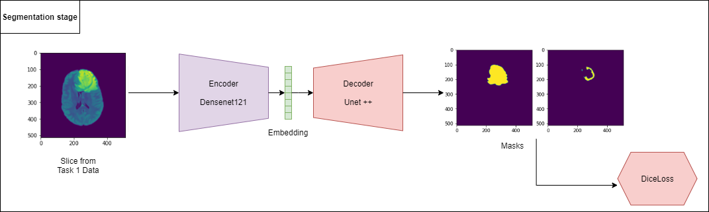
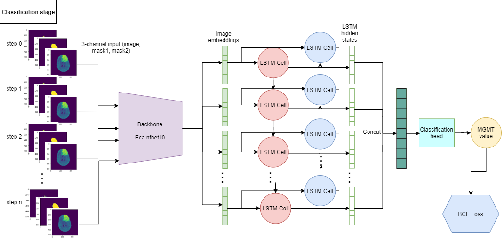

# RSNA-MICCAI 2021 Brain Tumor Challenge
## 1. Hardware specification
Here is the hardware we used to produce the result
  - CPU specs: Intel(R) Xeon(R) CPU E5-2698 v4 @ 2.20 GHz
  - Number of CPU cores: 80
  - GPU specs: Nvidia Tesla V100 32GB 
  - Number of GPUs: 4 (The final model was trained on a single Tesla V100)
  - Memory: 512GB
## 2. OS and softwares
  - OS: Ubuntu 18.04.5 LTS
  - Cuda: 11.0
  - Python: 3.6.9
  - Python packages are listed in requirements.txt
## 3. Dataset download
  - Download raw dicom dataset from the competition home page and extract it to *data/raw_dicom_data* folder: https://www.kaggle.com/c/rsna-miccai-brain-tumor-radiogenomic-classification/data. The directory contains:
    - train/
    - test/ 
    - sample_submission.csv
    - train_labels.csv
  - Download jpg data (converted from dicom files) and extract it to *data/raw_jpg_data* from url: https://www.kaggle.com/namgalielei/miccaibraintumorjpgdata. The directory contains:
    - data/
  - Download task 1 data (BraTS21 3D tumor segmentation dataset) and extract to *data/task1_data* from url: https://www.kaggle.com/dschettler8845/brats-2021-task1 (Credit for Darien Schettler who uploaded it). The directory contains something like:
    - BraTS2021_00000/
    - BraTS2021_00002/
    - BraTS2021_00003/
    - ....
## 4. Install packages
````
    pip install -r requirements.txt
````
## 5. Model download
  - We provided our already trained models that can be loaded and run inference
  - Run this command to automatically download all the models. They are saved inside the *model/* directory
````
    python download_models.py
````

## 6. Solution overview
### 6.1. Architecture:
Our best model on the private leaderboard is the one that combined a 2 stage training and inference. 
- The first stage was independently training a **segmentation model** that could segment the tumor masks properly (We called this segmentation stage).
- The second stage was the classification stage, where a **classification model** was trained. We used the trained segmentation model to generate the tumor masks, *combining with the original images to form a 3-channel inputs* that were taken by the classification model to train and run inference on.
- All the models approached the problem using 2D image. Segmentation stage used a Unet++ model with Densenet121 backbone and the classification stage utilized an architecture of Long Short Term Memory with Eca NFNet L0 backbone as a feature extractor.
  




### 6.2. Stage 1 detail
- There is a parrallel track held by the same host called Task 1, besides Task 2 which was hosted on Kaggle. The dataset is provided in 3D arrays with shape (240,240,155), stored in nii.gz files.
- Remove data of patients overlapping with those in Task 2 data: Task 1 data has 1251 samples corresponding to 1251 unique patients. However, there are about 574 patients with IDs overlapping with Task 2 data. In order to prevent data leakage, it was safer to remove data of overlapping patients. Thus, only the non-overlapping part was kept, which had about 677 3D samples.
- Data preparation: with each 3D sample, we extracted 2D slices and their corresponding masks from each plane: Coronal, Sagital and Axial. To illustrate, if there are 600 3D samples, 4 MRI types each, 3 different plane views, and within each 3D sample we were able to extract 100 slices, then the total 2D images received is 600x4x3x100. 
- Sampling: Because nearby slices in the same plane are usually very similar to each other, we used a sampling method to keep only relatively distinct images. We believed that it did no harm for training the model, and certainly reduced the training time.
- Filtering: Only images with tumor area over brain area more than 0.01 were kept. We think that would make the model model stable during training
- Image size: 224x224x3
- Mask: Refer to the competition paper [1], we constructed 2 types of masks for each 2D image: Whole Tumor (WT) and Enhancing Tumor (ET). WT represents the morphology of the whole tumor while ET is the middle layer wrapping the necrotic part to form the tumor core.
- Model: Densenet121 backbone with a linear classifier layer at top, pretrained on imagenet
- Training: All images regardless of mri types and planes after the filtering step above are used. Note that a set of 20% patient was held out to validate the model during training. At first, the backbone was freezed to warm up in 10 epochs, then, we unfreezed it and trained to more than 180 epochs when the improvement are minor. 

### 6.3. Stage 2 detail
- Data preparation: Using the trained segmentation model on Task 2 data to generate 2 types of mentioned masks, we concatenated them with the original image to create 3-channel 2D images as the input for this second stage.
- Filtering: We used the predicted masks to determine which images should be kept during training. Only images with predicted tumor area over brain area larger than 0.025 were considered as informative. Besides, we also decided to remove ones with total number of separated tumor contours more than 5 to avoid noises, because it was unlikely that we have a brain with multiple tumors.
- Chunking: By using LSTM, we inputed a series of 3-channel images into the model at the same time, we needed to determine how many *time-step* per series. By viewing the distribution of number of images in each series and after doing some tuning, we decided that the sequence length was 35. This would not be an optimal one, but we found the result acceptable. Larger sequence lenght might lead to unstable training and much resource comsumption. So, for each series, we create consecutive 35-step chunks with stride 5 and treated them as independent samples when training.
- Image: 224x224x3
- Model: Biderectional LSTM with Eca nfnet l0 backbone extractor. The backbone is shared between time steps and output an embedding of size 2034. The hidden size of the LSTM cell is 64. All the embedding from all the time steps are concatenated before going to a linear classifier. 
- Training: We trained a model for each MRI type separatedly, data from 20% patients was held out for validation. The backbone was freeze and warm up for 5 epochs before unfreezing and continued training. 
- Inference: Because we splitted 1 series of 1 patients to many chunks, the final prediction of 1 patient was the average of all the probability outputs of those chunks. We observe that this kind of *emsembling* make the model more robust. 
- TTA: Specific for test set, we checked that the ratio of tumor area over brain area was smaller in some cases, so we decided use TTA Zoom In 1.2 as the post processing step.
  
## 7. Result and observation:
### Stage 1 result
|              | Valdidation Dice Loss | Validation IOU Score |
| :---- | :---- | :---- |
| Segmentation model | 0.077 | 0.856 |

We were pretty confident with the segmentation model because the results it outputted were good, and the training and validation loss perfectly correlated.  

### Stage 2 result
|              | Valid AUC (patient) | Public LB AUC| Private LB AUC |
| :---- | :---- | :---- | :---- |
| Classification model | 0.685 | 0.678 | 0.60696

While training we found that the classification model could quickly go overfiting, we still think that this task need more data to be trained on, before we can conclude that whether or not this is feasible in practice.

**Note that the AUC is calculated among patients, which requires averaging predictions of all chunks belong to each patient to obtain that person's prediciton.**

## 8. How to train and run inference
### 8.1. Quick inference on RSNA MICCAI Brain Tumor challenge test set
- Make sure you have already downloaded the dicom data and the trained models from the challenge as guided above.
````
    python inference_on_test.py --gpu <gpu id> --classification_batch_size <bs1> --classification_batch_size <bs2> --fast_sub 0
````
- This will create a csv prediction file: data/test_prediction.csv

### 8.2. Train segmentation model (stage 1)
- Make sure you have already downloaded the Task 1 data and the pretrained models as mentioned above. 
- Prepare segmentation data. This will create and **overwrite content** in folder: data/processed_segmentation_data
````
    python prepare_segmentation_data.py 
````
- Train segmentation model. This will create folder: models/densenet121_2d_segment. **NOTE: It will overwrite the prexisting weights and training log files in this folder**
````
    python train_segmentation.py --gpu <gpu id> --batch_size <bs> --n_workers <nw>
````

### 8.3. Train classification model (stage 2)
- Make sure you have already downloaded the jpg data and the pretrained models as mentioned above. 
- Make sure you haved the trained segmentation model under this path: models/densenet121_2d_segment/Fold0_densenet121_2d_segmentation.pth
- Prepare the classification data. This will create and **overwrite content** in folder: data/processed_classification_data
````
    python prepare_classification.py --gpu <gpu id> --batch_size <bs> --n_workers <nw>
````
- Train classification model. This will create folder: models/eca_nfnet_l0_2d_classification. **NOTE: It will overwrite the prexisting weights and training log files in this folder**
````
    python train_classification.py --gpu <gpu id> --batch_size <bs> --n_workers <nw>
````
**Note that the log you see on training did not reflect the patient AUC, instead it was the chunk AUC. To get the patient AUC you need to average the prediction of all the chunk belonging to that patient.**


## 9. Final submission notebook
- Original submission notebook at: [T4E Final Submiision](https://www.kaggle.com/namgalielei/ensemble-brainlstm-v6-tta-zoomin/notebook)
- Notebook after update dataset version [T4E Final Submiision Update DS](https://www.kaggle.com/namgalielei/fix-deleted-data-ensemble-brainlstm-v6-tta-zoomin)

## 10. What did not work
- We have spent a lot of time and with many different approaches but it did not work, or at least we were not able to make it work.
- At first we tried 3D model because we believed that the information represented in 3D space was much more rational and the data was easier to manage. But the point was how to normalize the 3D arrays of voxels in some consistent ways. We used both simple and complex methods form rotating the brain onto the similar plane and direction then resizing to a fixed shape, to registering to SRI24 as done in Task 1 data by the host. We found out that the registration data was good and it not only preserved the spacing of the voxels in space but also ensured all the brains to lie consitently on a direction. However, no matter good the registration data looked, the model still perform badly on the public leaderboard. Besides, lack of pretrained weights for 3D model was another factor that could affect the model performance, especially when the number of training data was small.
- In exploring external dataset, we found some that could be relevant to the problem: IXI dataset, fastMRI dataset, TCIA dataset and tried to manipulate them for self-supervised training and speudo labeling but we failed to have a better result. 

## 11. References
[1] The RSNA-ASNR-MICCAI BraTS 2021 Benchmark on Brain Tumor Segmentation and Radiogenomic Classification: https://arxiv.org/abs/2107.02314

[2] UNet++: A Nested U-Net Architecture for Medical Image Segmentation: https://arxiv.org/abs/1807.10165

[3] Long Short-term Memory: https://www.researchgate.net/publication/13853244_Long_Short- term_Memory

[4] segmentation model pytorch: https://github.com/qubvel/segmentation_models.pytorch 

[5] timm: https://github.com/rwightman/pytorch-image-models

## 12. Future issues
If you find any problems running the code, or have any questions regarding the solution, please contact me at: namnguyen6101@gmail.com and create an issue on the Repo's Issue tab.